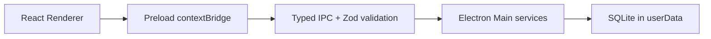

# Architecture

```mermaid
flowchart LR
  R[React Renderer] --> P[Preload contextBridge]
  P --> I[Typed IPC + Zod validation]
  I --> S[Electron Main services]
  S --> D[SQLite in userData]
```

Renderer는 Node와 SQLite에 직접 접근하지 않습니다. 단일 인스턴스, 외부 탐색 차단, context isolation, sandbox, CSP를 적용합니다.
