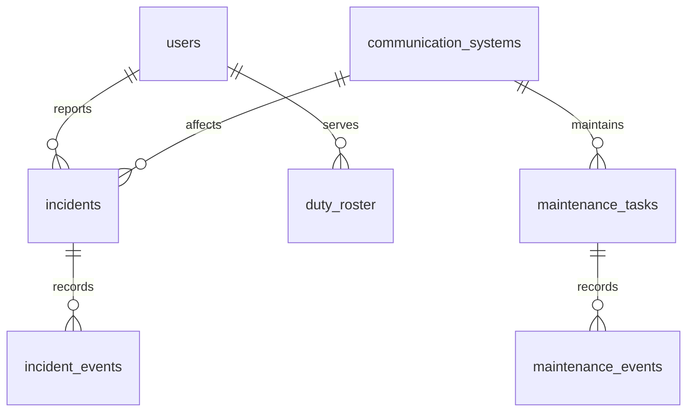

# Database

SQLite DB는 설치 폴더 밖의 `%APPDATA%/OMNIS/data/omnis.db`에 있습니다. `PRAGMA user_version` 기반 마이그레이션과 최초 seed 복사를 사용합니다. 백업은 `%APPDATA%/OMNIS/backups`에 최근 10개를 유지합니다.

```mermaid
erDiagram
 users ||--o{ incidents : reports
 users ||--o{ duty_roster : serves
 communication_systems ||--o{ incidents : affects
 communication_systems ||--o{ maintenance_tasks : maintains
 incidents ||--o{ incident_events : records
 maintenance_tasks ||--o{ maintenance_events : records
```
